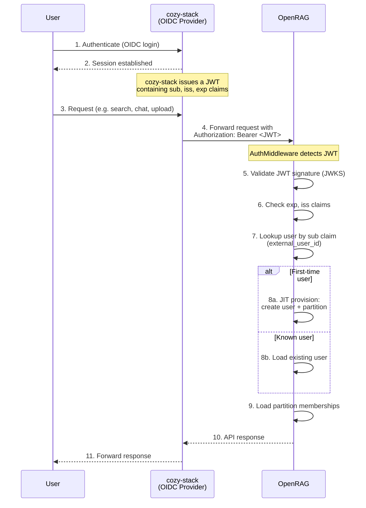
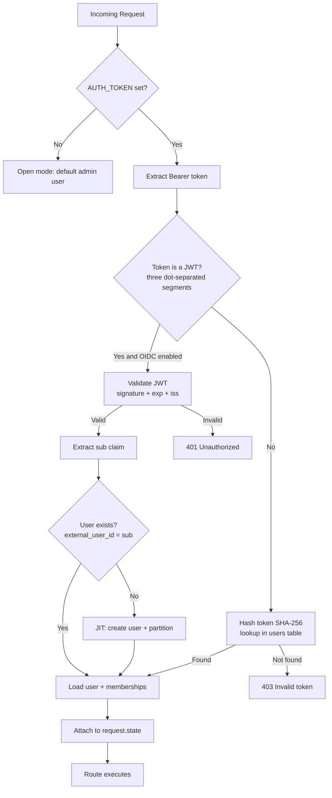
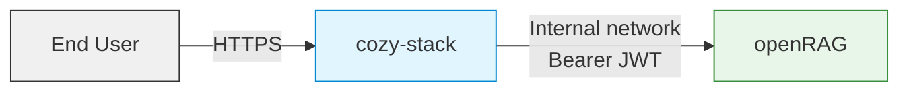

This document explains how **user authentication** and **access control** work within the application.
It covers token-based auth, OIDC integration with cozy-stack, and partition-level permissions.

OpenRAG supports **two authentication mechanisms** that coexist:

| Mechanism | Use case | Identity source |
|-----------|----------|-----------------|
| **Token-based** | Admin operations, direct API access | Opaque token hashed with SHA-256 |
| **OIDC JWT** | Users proxied through cozy-stack | JWT signed by cozy-stack’s OIDC keys |

---

## **1. Authentication Activation**

### `AUTH_TOKEN`
- The presence of the environment variable **`AUTH_TOKEN`** activates authentication.
- If **`AUTH_TOKEN`** is **absent**, the middleware **bypasses all authentication checks**, allowing open access (useful for local or testing environments).

### `OIDC_ISSUER_URL` (optional)
- Setting **`OIDC_ISSUER_URL`** enables OIDC JWT authentication alongside token-based auth.
- On startup, openRAG fetches the OIDC discovery document at `{OIDC_ISSUER_URL}/.well-known/openid-configuration` and caches the provider’s signing keys (JWKS).
- If the discovery endpoint is unreachable at startup, OIDC is disabled with a warning (the application does not crash).

:::danger[Attention !!!]
**`SUPER_ADMIN_MODE=true`** must be activated if you want admin users to access all existing partitions, not just the admin’s own partitions.
:::

---

## **2. Admin Bootstrapping**

When `AUTH_TOKEN` is set:
1. On startup, the application checks whether an **admin user** already exists in the database.
2. If not, it **creates one automatically**:
   - `display_name`: `"Admin"`
   - `is_admin`: `True`
   - `token`: SHA-256 hash of the `AUTH_TOKEN` value

This admin user serves as the global entry point for bootstrapping the system.

---

## **3. Token-Based Authentication**

### Generation
- Each new user is assigned a token at creation time (format: `or-<random hex>`).
- The app **returns the raw token** to the API caller once (e.g., `POST /users` response).

### Storage
- Only a **SHA-256 hash** of the token is stored in PostgreSQL.
- The raw token **is never persisted**, ensuring that leaked database contents cannot reveal user credentials.

### Validation
- When an API request includes an **`Authorization: Bearer <token>`** header and the token is **not a JWT**:
  1. The middleware extracts the token.
  2. The hash of this token is computed.
  3. The hash is compared against the stored value in the `users` table.

---

## **4. OIDC Authentication (cozy-stack)**

### Overview

OpenRAG can validate OIDC JWTs issued by **cozy-stack**, which acts as both the OIDC identity provider and the backend proxy for end users. This removes the need to create and manage per-user tokens in openRAG — cozy-stack handles user authentication via OIDC, and openRAG trusts the resulting JWTs.

### How It Works

1. A user authenticates with **cozy-stack** using standard OIDC (browser login, OAuth flow, etc.).
2. cozy-stack obtains an **ID token** (JWT) from its own OIDC provider.
3. When cozy-stack makes API calls to openRAG on behalf of this user, it forwards the JWT in the `Authorization: Bearer <jwt>` header.
4. openRAG’s **AuthMiddleware** detects that the token is a JWT (three dot-separated segments) and validates it:
   - Verifies the **signature** against the OIDC provider’s public keys (JWKS)
   - Checks the **expiry** (`exp` claim)
   - Confirms the **issuer** (`iss` claim) matches `OIDC_ISSUER_URL`
5. The `sub` (subject) claim is extracted and mapped to an openRAG user via the `external_user_id` field.

### Token Exchange Flow

### AuthMiddleware Decision Flow

### JIT User Provisioning

When openRAG receives a valid JWT with a `sub` claim that doesn’t match any existing `external_user_id`, it automatically provisions the user:

1. **Creates a new user** in PostgreSQL:
   - `external_user_id` = the `sub` claim
   - `display_name` = from the JWT `name` or `preferred_username` claim (falls back to `sub`)
   - `token` = `NULL` (OIDC users authenticate via JWT, not opaque tokens)
   - `is_admin` = `false`
2. **Creates a personal partition** named after the `sub` claim
3. **Assigns the user as `owner`** of that partition

This all happens in a single database transaction. Subsequent requests with the same `sub` skip creation and load the existing user.

:::note
JIT-provisioned users start as non-admin with access only to their personal partition. An admin must explicitly grant additional partition access or admin privileges.
:::

### JWKS Key Rotation

OpenRAG caches the OIDC provider’s signing keys (JWKS) in memory. When a JWT contains a `kid` (key ID) that isn’t in the cache, openRAG automatically re-fetches the JWKS from the provider. This handles key rotation transparently without requiring a restart.

### Configuration

| Variable | Type | Default | Description |
|----------|------|---------|-------------|
| `OIDC_ISSUER_URL` | `string` | *not set* | Base URL of the OIDC provider (e.g. `https://cozy-stack.example.com`). When set, enables JWT authentication. OpenRAG fetches `.well-known/openid-configuration` from this URL on startup. |

---

## **5. User Roles**

### Admin
- Full access to all API routes, including:
  - User management
  - Actor management
  - Queue and system information
- Can also create other users and assign privileges.
- Admins can use the app **as regular users** (own partitions, files, etc.).
- By default, an admin **cannot view other users’ data**.

### Super Admin Mode
- Controlled by the environment variable **`SUPER_ADMIN_MODE`**.
- When `SUPER_ADMIN_MODE=true`:
  - The admin can access **all partitions and data** across users.
  - Partition-level access restrictions are ignored.
- When `SUPER_ADMIN_MODE=false`:
  - Admin privileges are **limited to admin-only operations** (user creation, actor management, etc.).
  - Data-level access (partitions/files) requires using a normal user account.

---

## **6. Regular Users**

- **Token-based users**: Created by an admin via the `/users` endpoint. Receive a personal API token (returned once upon creation).
- **OIDC users**: Automatically created on first JWT authentication (JIT provisioning). No opaque token is generated.

Both can authenticate using `Authorization: Bearer <token-or-jwt>`.

Users can:
- Create and manage **their own partitions** and **files**.
- Access shared partitions based on assigned roles.

---

## **7. Partition Access Roles**

Access control is handled through the **`partition_memberships`** table.
Each user-partition relationship defines a **role**:

| Role | Description | Capabilities |
|------|--------------|---------------|
| **owner** | Partition creator or owner | Full access — can delete the partition, manage members, edit files, etc. |
| **editor** | Collaborator | Can read and write files within the partition |
| **viewer** | Read-only member | Can view content and perform semantic search or chat but not modify data |

Role-based restrictions are enforced via dependency guards:
- `require_partition_owner`
- `require_partition_editor`
- `require_partition_viewer`

These roles apply identically to both token-based and OIDC users.

---

## **8. Authorization Flow Summary**

1. Request arrives with `Authorization: Bearer <token-or-jwt>`.
2. If `AUTH_TOKEN` is **unset**, authentication is skipped (open mode).
3. If set, the middleware determines the auth method:
   - **JWT detected** (and OIDC enabled): validate signature, expiry, and issuer; resolve user by `sub` claim; JIT-create if needed.
   - **Opaque token**: hash with SHA-256, look up user in the database.
4. User info and memberships are attached to `request.state`.
5. Role-based dependencies ensure the user has proper privileges before executing the endpoint logic.

---

## **9. Security Analysis**

### Token-Based Auth Security

- **No plaintext tokens** stored in database — only SHA-256 hashes.
- Tokens are shown **once** at creation and cannot be recovered.
- Admin privileges are **separated** from regular user data access.

### OIDC Auth Security

#### Trust Model

openRAG trusts **cozy-stack as the identity provider**. The security of OIDC authentication depends on:

| Trust boundary | What openRAG verifies | What openRAG trusts |
|----------------|----------------------|---------------------|
| **JWT signature** | Verified against JWKS public keys from the discovery endpoint | That the OIDC provider’s private keys are not compromised |
| **Token expiry** | `exp` claim checked on every request | That cozy-stack sets reasonable expiry times |
| **Issuer** | `iss` claim must match `OIDC_ISSUER_URL` | That no other service shares the same issuer URL |
| **User identity** | `sub` claim mapped to `external_user_id` | That cozy-stack assigns unique, stable `sub` values per user |

#### What Is Verified on Every Request

1. **Cryptographic signature** — the JWT is signed with a key from the provider’s JWKS. Tampered tokens are rejected.
2. **Expiry** (`exp`) — expired tokens are rejected. This limits the window of exposure if a token is leaked.
3. **Issuer** (`iss`) — must exactly match the configured `OIDC_ISSUER_URL`. Prevents accepting tokens from unrelated providers.
4. **Required claims** — `sub`, `iss`, and `exp` must all be present.

#### What Is NOT Verified

- **Audience** (`aud`) — openRAG does not check the `aud` claim. If cozy-stack issues tokens intended for multiple services, any valid cozy-stack JWT would be accepted by openRAG. This is acceptable when cozy-stack is the sole OIDC provider and openRAG is its only resource server. If cozy-stack serves multiple resource servers, adding `aud` verification should be considered.
- **Token revocation** — openRAG does not call a token introspection endpoint. If a user’s access is revoked in cozy-stack, their existing JWTs remain valid until they expire. Mitigation: use short-lived tokens (e.g., 5-15 minutes).
- **Partition-level claims** — OIDC is used for **identity only**. Partition access is managed entirely within openRAG. The JWT does not encode what a user can access.

#### JIT Provisioning Risks

| Risk | Mitigation |
|------|------------|
| **Any valid JWT creates an account** | Only JWTs signed by the configured OIDC provider are accepted. Restrict `OIDC_ISSUER_URL` to a trusted provider. |
| **Partition name collision** | Partitions are named after the `sub` claim. If a partition with that name already exists (created by another mechanism), the user is added as owner without overwriting data. |
| **Race condition on first login** | Concurrent first-login requests for the same user are handled with `INSERT ... ON CONFLICT` to prevent duplicate accounts. |
| **JIT users start with no admin rights** | By design. Admin must be granted explicitly. |

#### JWKS Security

- Public keys are fetched over **HTTPS** from the OIDC discovery endpoint.
- Keys are cached in memory and **refreshed on demand** when an unknown `kid` is encountered (handling key rotation).
- If the JWKS endpoint becomes unreachable after startup, openRAG continues using cached keys. New keys from a rotation would not be loaded until the endpoint is reachable again.

#### Network Security Considerations

Since cozy-stack proxies all requests, openRAG’s API is not directly exposed to end users. This provides an additional layer:

- The openRAG API should ideally only be accessible from cozy-stack’s network, not from the public internet.
- The admin token (`AUTH_TOKEN`) used by cozy-stack for system operations should be treated as a **secret** and rotated periodically.
- OIDC JWTs should have **short expiry times** (5-15 minutes) since openRAG does not support token revocation.

#### Recommendations for Production

1. **Restrict network access** to openRAG’s API — only allow connections from cozy-stack’s infrastructure.
2. **Use short-lived JWTs** (5-15 min expiry) to limit exposure from leaked tokens.
3. **Monitor JIT user creation** — unexpected new users could indicate a misconfigured or compromised OIDC provider.
4. **Consider adding `aud` verification** if cozy-stack issues tokens for multiple services.
5. **Keep `AUTH_TOKEN` secret** — it provides full admin access and should be stored in a secrets manager, not in plaintext config files.

---

